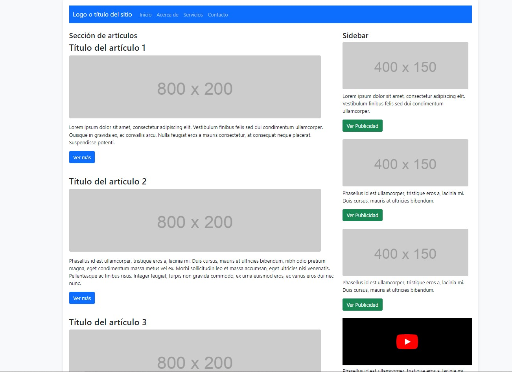

# SEXTO PROYECTO: TIPO PLANTILLA MINI BLOG HTML5 Y CSS3

Este proyecto es una plantilla de mini blog desarrollada con HTML5 y CSS3, utilizando Bootstrap para el diseño y componentes. Esta plantilla puede ser utilizada como punto de partida para la creación de un mini blog personalizado.

## Contenido del Proyecto

- **index.html**: Archivo HTML principal que representa la estructura básica del mini blog utilizando Bootstrap.
- **style.css**: Archivo CSS personalizado para estilizar la plantilla.
- **icono.png**: Icono del sitio web.
- **imagen/**: Carpeta que contiene imágenes utilizadas en la página, como capturas de pantalla.

# CAPTURAS DE PANTALLA:




## Estructura de la Página

La página HTML utiliza Bootstrap para crear una estructura de mini blog responsiva:

- La barra de navegación en la parte superior permite la navegación entre las secciones.
- La sección principal incluye varios artículos con imágenes y contenido.
- La barra lateral (aside) contiene anuncios publicitarios y un reproductor de video de ejemplo.
- El pie de página muestra información adicional.

## Uso de Bootstrap

Se utiliza Bootstrap 5 para estilizar y dar funcionalidad a la plantilla. Puedes personalizar y extender esta plantilla según tus necesidades específicas.

### Lin Pagina Web:

## Cómo Usar

1. Clona este repositorio en tu máquina local:

```bash
git clone https://github.com/tuusuario/Plantilla-Mini-Blog-HTML5-CSS3.git
